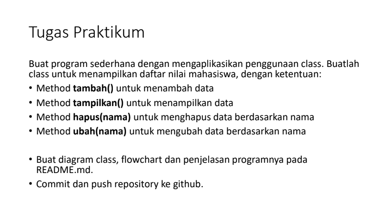
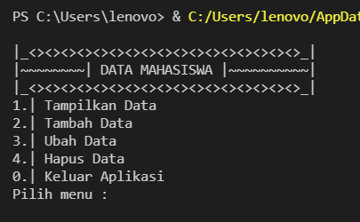
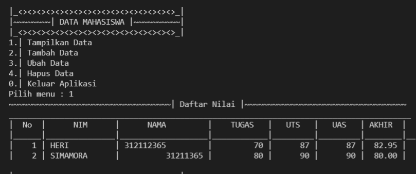
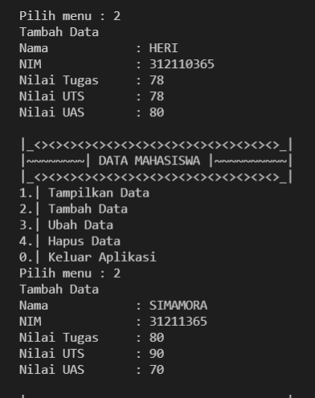
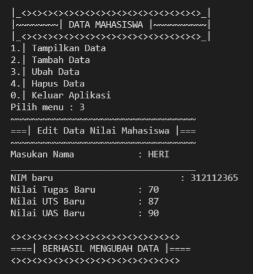
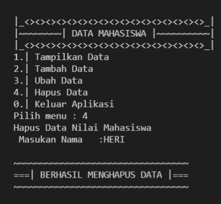
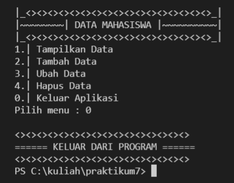
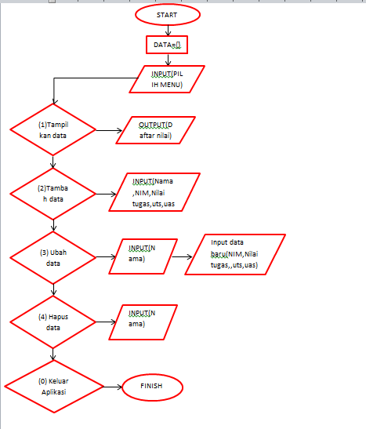

# TUGAS PERTEMUAN 12 DAN PENJELASAN 
| Nama | kelas | Nim | Matkul |
| -- | --- | ---- | ----------- |
| Heri Anto Simamora | TI.21.C.1 | 312110365 | Bahasa Perograman |

## DAFTAR ISI 
| No. | ISI | PENJELASAN |
| -- | --- | ---------- |
| 1. | Praktikum  | [penjelasan](#praktikum) |

## PRAKTIKUM 


## SOURCE CODE PRAKTIKUM
``` python
data={}

class mhs():
    def tambah():
        print("Tambah Data")
        nama = input("Nama\t\t: ")
        nim = int(input("NIM\t\t: "))
        tugas = int(input("Nilai Tugas\t: "))
        uts = int(input("Nilai UTS\t: "))
        uas = int(input("Nilai UAS\t: "))
        nilaiakhir = (tugas * 0.3 + uts * 0.35 + uas * 0.35)
        data[nama] = nim, tugas, uts, uas, nilaiakhir
    def tampilkan():
        if data.items():
            print("~~~~~~~~~~~~~~~~~~~~~~~~~~~~~~~~~~~| Daftar Nilai |~~~~~~~~~~~~~~~~~~~~~~~~~~~~~~~~~~~")
            print("_______________________________________________________________________________________")
            print("|  No  |      NIM      |      NAMA         |    TUGAS   |   UTS   |   UAS   | AKHIR  |")
            print("|______|_______________|___________________|____________|_________|_________|________|__")
            i = 0
            for a in data.items():
                i += 1
                print(f"| {i:4} | {a[0]:13s} | {a[1][0]:17} | {a[1][1]:10d} |  {a[1][2]:6d} | {a[1][2]:7d} | {a[1][4]:6.2f} | ")
        else:
            print("~~~~~~~~~~~~~~~~~~~~~~~~~~~~~~~~~~~| Daftar Nilai |~~~~~~~~~~~~~~~~~~~~~~~~~~~~~~~~~~~")
            print("_______________________________________________________________________________________")
            print("|  No  |      Nama     |      NIM      |   TUGAS  |   UTS   |   UAS   | Nilai Akhir  |")
            print("_______________________________________________________________________________________")
            print("|      |               |             Tidak Ada Data         |         |                |")
            print("____________________________________________________________________________________________")
    def hapus():
        print("Hapus Data Nilai Mahasiswa")
        nama = input(" Masukan Nama\t:")
        if nama in data.keys():
            del data[nama]
            print()
            print("~~~~~~~~~~~~~~~~~~~~~~~~~~~~~~~~~")
            print("===| BERHASIL MENGHAPUS DATA |===")
            print("~~~~~~~~~~~~~~~~~~~~~~~~~~~~~~~~~")
        else:
            print("Data {0} tidak ada".format(nama))
    def ubah():
        print("~~~~~~~~~~~~~~~~~~~~~~~~~~~~~~~~~~~")
        print("===| Edit Data Nilai Mahasiswa |===")
        print("~~~~~~~~~~~~~~~~~~~~~~~~~~~~~~~~~~~")
        nama = input("Masukan Nama\t\t: ")
        print("___________________________________")
        if nama in data.keys():
            nim = input("NIM baru\t\t\t: ")
            tugas = int(input("Nilai Tugas Baru\t: "))
            uts = int(input("Nilai UTS Baru\t\t: "))
            uas = int(input("Nilai UAS Baru\t\t: "))
            nilaiakhir = (tugas * 30 / 100 + uts * 35 / 100 + uas * 35 / 100)
            data[nama] = nim, tugas, uts, uas, nilaiakhir
            print()
            print("<><><><><><><><><><><><><><><><>")
            print("====| BERHASIL MENGUBAH DATA |====")
            print("<><><><><><><><><><><><><><><><>")
        else:
            print("Data nilai {0} tidak ada ".format(nama))
while True:
    print("")
    print("|_<><><><><><><><><><><><><><><><><>_|")
    print("|~~~~~~~~| DATA MAHASISWA |~~~~~~~~~~|")
    print("|_<><><><><><><><><><><><><><><><><>_|")
    x = input("1.| Tampilkan Data \n2.| Tambah Data \n3.| Ubah Data \n4.| Hapus Data \n0.| Keluar Aplikasi \nPilih menu : ")
    if x.lower() == "1":
        mhs.tampilkan()
    elif x.lower() == "2":
        mhs.tambah()
    elif x.lower() == "3":
        mhs.ubah()
    elif x.lower() == "4":
        mhs.hapus()
    elif x.lower() == "0":
        print()
        print("<><><><><><><><><><><><><><><><>")
        print("====== KELUAR DARI PROGRAM ======")
        print("<><><><><><><><><><><><><><><><>")
        break
    else:
        print()
        print("<><><><><><><><><><><><><><><><>")
        print("== Pilihan Anda Tidak Tersedia ==")
        print("== Pilihlah Menu Yang Tersedia ==")
        print("<><><><><><><><><><><><><><><><>")

``` 
## HASIL KELUARAN DAN PENJELASAN

- Buatlah kamus yang akan diinput oleh data<p>
```pyhton
data = {}
```

- Buatlah definisi class dari program <p>
``` pyhton
class mhs():
```

- membuat methode atau fungsi untuk mengakses nilai mahasiswa<p> 

• Method tambah() untuk menambah data <p>
• Method tampilkan() untuk menampilkan data<p>
• Method hapus(nama) untuk menghapus data berdasarkan nama<p>
• Method ubah(nama) untuk mengubah data berdasarkan nama<p>
• while True untuk menjalankan menu mana yang akan kita jalankan sesuai pilihan kita saat kita input <p>

```pyhton
def tambah():
def tampilkan():
def hapus():
def ubah():
```

- Ketika program di run pada pertama kali, maka akan muncul tampilan seperti ini :<p>


Terdapat 5 pilihan menu yaitu :<p>
  1 Tampilkan Data<p>
  2 Tambah Data <p>
  3 Ubah Data <p>
  4 Hapus Data<p>
  0 Keluar Aplikasi<p>

- Tampilkan Data<p>
System akan menjalankan fitur ini ketika user mengetikkan perintah 1 pada pilihan Pilih Menu (1-2-3-4-0) Inilah tampilan fitur Tampilkan Data :<p>



```pyhton
def tampilkan():
        if data.items():
            print("~~~~~~~~~~~~~~~~~~~~~~~~~~~~~~~~~~~| Daftar Nilai |~~~~~~~~~~~~~~~~~~~~~~~~~~~~~~~~~~~")
            print("_______________________________________________________________________________________")
            print("|  No  |      NIM      |      NAMA         |    TUGAS   |   UTS   |   UAS   | AKHIR  |")
            print("|______|_______________|___________________|____________|_________|_________|________|__")
            i = 0
            for a in data.items():
                i += 1
                print(f"| {i:4} | {a[0]:13s} | {a[1][0]:17} | {a[1][1]:10d} |  {a[1][2]:6d} | {a[1][2]:7d} | {a[1][4]:6.2f} | ")
        else:
            print("~~~~~~~~~~~~~~~~~~~~~~~~~~~~~~~~~~~| Daftar Nilai |~~~~~~~~~~~~~~~~~~~~~~~~~~~~~~~~~~~")
            print("_______________________________________________________________________________________")
            print("|  No  |      Nama     |      NIM      |   TUGAS  |   UTS   |   UAS   | Nilai Akhir  |")
            print("_______________________________________________________________________________________")
            print("|      |               |             Tidak Ada Data         |         |                |")
            print("____________________________________________________________________________________________")
```

- Tambah Data<p>
System akan menjalankan fitur ini ketika user mengetikkan perintah 2 pada pilihan Pilih Menu (1-2-3-4-0) dan kita bisa menambahkan data pada program Inilah tampilan fitur Tambah Data :<p>



``` pyhton
def tambah():
        print("Tambah Data")
        nama = input("Nama\t\t: ")
        nim = int(input("NIM\t\t: "))
        tugas = int(input("Nilai Tugas\t: "))
        uts = int(input("Nilai UTS\t: "))
        uas = int(input("Nilai UAS\t: "))
        nilaiakhir = (tugas * 0.3 + uts * 0.35 + uas * 0.35)
        data[nama] = nim, tugas, uts, uas, nilaiakhir
```
- Ubah Data <p>
System akan menjalankan fitur ini ketika pengguna mengetikkan 3 perintah pada pilihan Pilih Menu (1-2-3-4-0)
Pada fitur ini user akan diminta untuk memilih data siapa yang akan diubah dan data apa yang akan dirubah Setelah user memilih data, Misalnya user ingin merubah NIM dari mahasiswa dengan nama heri , Maka akan muncul tampilan seperti ini :<p>



```pyhton
def ubah():
        print("~~~~~~~~~~~~~~~~~~~~~~~~~~~~~~~~~~~")
        print("===| Edit Data Nilai Mahasiswa |===")
        print("~~~~~~~~~~~~~~~~~~~~~~~~~~~~~~~~~~~")
        nama = input("Masukan Nama\t\t: ")
        print("___________________________________")
        if nama in data.keys():
            nim = input("NIM baru\t\t\t: ")
            tugas = int(input("Nilai Tugas Baru\t: "))
            uts = int(input("Nilai UTS Baru\t\t: "))
            uas = int(input("Nilai UAS Baru\t\t: "))
            nilaiakhir = (tugas * 30 / 100 + uts * 35 / 100 + uas * 35 / 100)
            data[nama] = nim, tugas, uts, uas, nilaiakhir
            print()
            print("<><><><><><><><><><><><><><><><>")
            print("====| BERHASIL MENGUBAH DATA |====")
            print("<><><><><><><><><><><><><><><><>")
        else:
            print("Data nilai {0} tidak ada ".format(nama))
```
- Hapus Data <p>
System akan menjalankan fitur ini ketika pengguna mengetikkan 4 perintah pada pilihan Pilih Menu (1-2-3-4-0) Sebelum saya menjalankan fitur ini, saya akan menambahkan 1 data lagi dengan nama simamora dan saya menghapus data heri <p>



```pyhton
def hapus():
        print("Hapus Data Nilai Mahasiswa")
        nama = input(" Masukan Nama\t:")
        if nama in data.keys():
            del data[nama]
            print()
            print("~~~~~~~~~~~~~~~~~~~~~~~~~~~~~~~~~")
            print("===| BERHASIL MENGHAPUS DATA |===")
            print("~~~~~~~~~~~~~~~~~~~~~~~~~~~~~~~~~")
        else:
            print("Data {0} tidak ada".format(nama))
```
- Keluar Aplikasi
System akan menjalankan fitur ini ketika pengguna mengetikkan 0 perintah pada pilihan Pilih Menu (1-2-3-4-0) program akan terhenti dan keluar dari program yang dijalankan <p>



## FLOWCHART PRAKTIKUM



## DIAGRAM KELAS


